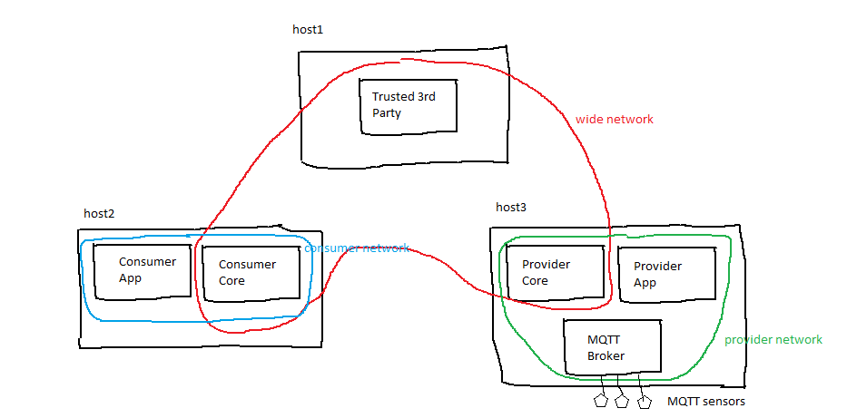

Internet of Things
==================
# Example Echo
This example demonstrates the use of Apache Camel routes to establish a communication between a client and a server applications that
communicate through two trusted connectors.

## Client application
It is a web application, developed in nodejs, with a simple user interface with a form in which a user can write a message to be sent to the server. The user can 
click on a button to send the message. The client web application will send the message, a string, to an MQTT topic. The trusted connector's 
core container listens to the topic and forward the messages to the other connector's endpoint where it will be dispatched to the server application 
according to the routing rules defined in the core container of that connector. The core container of the client's connector uses an Apache Camel
module to connect to the MQTT broker, read the messages and forward them to server's connector through a secure web socket.

### Client application's services
The client application is deployed in four Docker containers, each providing a service that communicates to support the client tasks

1. client-core
2. client-app
3. mqtt-broker  
4. tpm-simulator

The client-app is the container that hosts the client application that sends the user's messages to a topic in the mqtt broker. The mqtt-broker is the container
that hosts the mqtt broker. The client-core containers it the trusted connector itself that contains the Camel services and the routes to pass the user's messages
taken from the mqtt-broker to the secure web socket endpoint provided by the server' connector. The tpm-simulator is a container that can connect to a trusted 3rd
party to provide details about the host security. The client's core connector keystore for the secure web socket and the Camel routes xml files are made available
as docker volumes. A docker-compose file is provided to execute all the client application's services. All the client containers are member of a docker network 
named "clientnet". The client core connector is a member of another docker network, named "webnet", as well. 

## Server application    
The server side of the appication is an http endpoint where the client can send its data. The server receives the requests from the server's connector
router that, as for the client's connector, is implemented with Apache Camel. On the server side the router in the, core container, listen to the secure web socket and forward
the data according to the rules defined in its XML files.

### Server application's services
The server application is deployed in three Docker containers, each providing a service that communicates to support the server tasks

1. server-core
2. server-app
3. tpm-simulator

The server-app container hosts the http endpoint that receives the data sent through the secure web socket to the server's connector endpoint and dispached
to it according to the Camel rules defined in the server's core container. The server-core container is the same as the client core-connector, in that it 
is based on the same Docker image. The java server's core connector java keystore for the secure web socket and the Camel xml files are made available as docker 
volumes. As for the client application, a docker-compose file is provided to execute all the server application's services. All the server containers are member 
of a docker network named "servernet". The server core connector is a member of another docker network, named "webnet", as well so that the two core containers can
communicate using their containers' names.    

## IoT Use Case: Monitoring a production pipeline
This section presents a draft use case of an industrial setting where machines are used in a production pipeline. Each machine is connected to sensors and 
actuators for monitoring and control. As an example, the working temperature of a machine must be monitored to be sure it does not exceed a certain threshold. 
The sensors are connected to gateways, where trusted connectors have been deployed. A trusted connector is configured to collect and aggregate temperature data 
from a set of sensors in a time window, e.g. of one minute, and send the aggregated result to a topic created on an Apache Kafka cluster. The Kafka topic is fed 
by trusted consumer connectors that can apply some transformation, e.g. from text to a binary format, before forwarding the data to a Kafka topic. The messages 
sent to the Kafka topics are integrated and processed at event time by, e.g. Apache Flink jobs, to provide an integrated overview of the status of each machine 
and of the pipeline. The output of the processing is finally sent to a data sink for monitoring, predictive maintenance, visualization, analytics.

